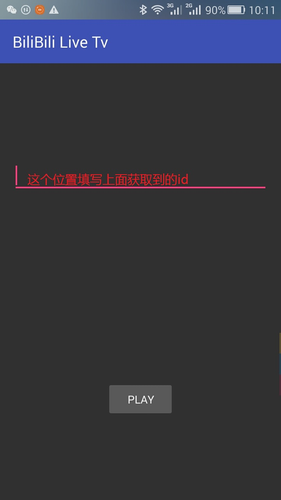
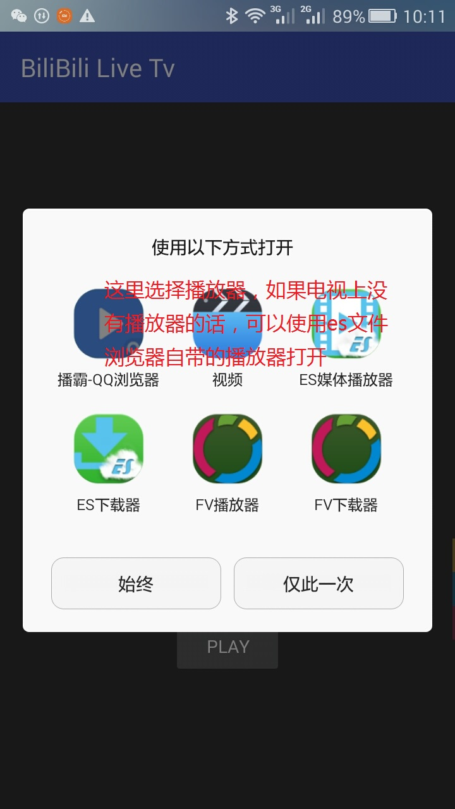
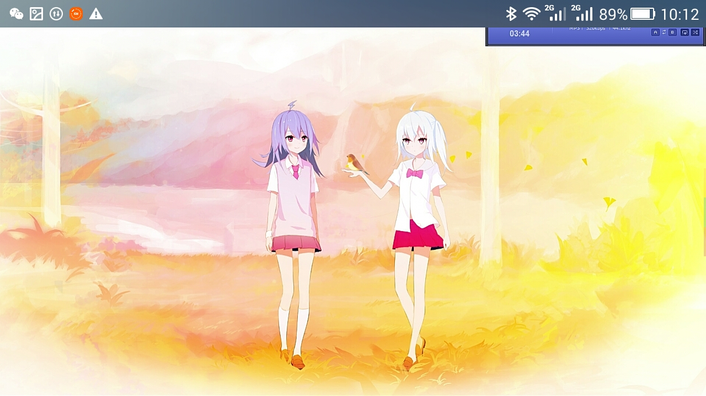

# BiliBili-Live-Tv
用于观看B站直播，由于某些原因在电视上看不了，所以自己做了一个，本人不会安卓开发，东拼西凑的代码，不保证通用。

本分支采用flv源，经测试，只有vlc安卓版才能正常打开。

* 本人开发环境环境：

 1. 华为g750-t00（安卓4.4.4）
 2. 天猫魔盒1s plus（一生黑的yunos 6.0.0）（没有机顶盒的亲们千万别买天猫魔盒，谁用谁后悔）

* 测试的播放器（注：卡顿可能与我的网络有关，下面关于卡顿的说明纯属玄学）
  1. ~~es文件浏览器（有点卡）~~
  2. ~~qq浏览器（不太卡）~~
  3. vlc android（终于不卡了，仅测试了flv版本，html5版本未测试）

* 已知问题

 1. 网络直接阻塞ui进程（我不会安卓，本来想看下异步怎么写来着，但是最近过年没时间）（实际使用感觉没太大影响）
 2. ~~有几个直播无法播放（这几个直播我用手机也没打开，不知道是我的网络问题还是什么情况，但是我试别的直播还都能看）~~（可以看了）
 3. ~~由于采用的是h5的源，貌似比flv源慢30秒左右~~本分支采用flv源
 4. 由于坑爹的天猫魔盒（一生黑，散热设计有问题，操作系统有后门，开机广告...，还不能换，以后坚决不再买阿里的东西），长时间播放可能会有卡顿（这玩意散热设计有问题，待机75°，播放live.bilibili.com/3的时候温度83-84，用过许多arm开发板的我表示从未见过如此高温，树莓派系列就不用说了，温度最多50+到60+，国产山寨一半60+到70+，上80的真没见过）（我一气之下拆掉了壳子，加了个风扇，目前温度能控制在65以下）

* 更新说明
  2017-1-26：添加cdn，更换flv源，推荐结合vlc安卓版使用（不能翻墙的朋友可以从酷安网下载）。

  2017-1-25：凑合用吧，本人大学狗，只是想凑合用电视看看拜年祭，以后有空更新，没空的话就抱歉了。

* 截图及使用说明

 1.liveId 获取

    1.1 手机版bilibili
     
     
     
    1.2 网页
     

  2.软件使用说明

    我没（不会）做视频播放器，直接调用的系统播放器，在天猫魔盒1sp上，可以使用es文件浏览器的播放器。
    
    
    
